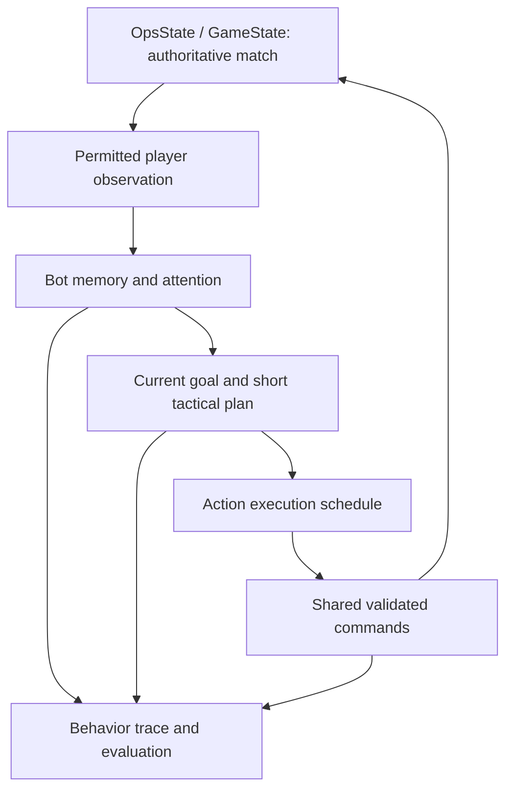

# Human-like bots: code review and implementation path

Date: September 14, 2026  
Reviewed checkout: `project`, branch `codex/iphone-startup-hitch-diagnosis`, HEAD `3447930`, including the current local input changes.  
Status: design recommendation; gameplay behavior has not been changed by this review.

Implementation update, September 15: see the [pilot checkpoint](bot_human_pilot_2026-09-15.md)
for completed changes, validation, and remaining work. Findings below describe the
pre-implementation checkout.

## Recommendation

Build a bot that has a consistent intention, notices events with limited attention, executes a short sequence of ordinary player actions, and revises its plan when the observed result disappoints it. Calibrate those behaviors against actual Swarmfront players. Keep the existing authoritative simulation and useful scoring helpers.

The first deliverable should be one convincing medium Balancer in ordinary 1v1 play. Make it handle distraction, reinforcement, retreat, and recovery before expanding the five personalities and specialized modes. The immediate prerequisite is trustworthy execution and evaluation: current tournament results omit important live mechanics.

The target is behavioral credibility within a declared skill range. No implementation can promise permanent indistinguishability to every expert. Keep bot disclosure in the product; assess behavior through informed playtests and separate blinded replay evaluations.

## 1. What the code actually supports

Useful foundations already exist:

- Five styles and three difficulty tiers, assembled in [OpsState](../scripts/ops/ops_state.gd), starting at line 1318.
- Read-only policy decisions and gameplay commands applied through OpsState.
- Heuristics for attack, feed, swarm, expansion, risk, reinforcement, and the current lead/deficit.
- Timing variation and cooldowns, plus style-specific hesitation and mistakes.
- Match action/event telemetry, sampled replay views, derived player-style features, local player profiles, and reports.
- Canonical simulation ticks and an existing authority snapshot interface.

The player-modeling foundation is further along than the March status document indicates. [PlayerTelemetryProfileStore](../scripts/state/player_telemetry_profile_store.gd) skips CPU entries and aggregates up to 50 recent matches. [MatchTelemetryCollector](../scripts/state/match_telemetry_collector.gd), lines 1318–1389, derives style features and suggested bot knobs. The live policy/profile construction does not consume those learned-from-play summaries. They are heuristic analytics, not a trained imitation policy.

## 2. Findings that should drive the implementation order

### A. Live bot time is not match-relative or reproducible

[BotSystem](../scripts/systems/bot_system.gd), line 37, passes `Time.get_ticks_msec()` into the policy. [BaselineBotPolicy](../scripts/bot/baseline_bot_policy.gd), lines 268, 430, 467, and 487, compares that value with opening-phase durations. Consequently, time spent in menus or prior matches can consume a bot's intended opening window before the new match starts. The random-choice hash also includes this uptime.

Reproduction: on the same Turtle fixture, with the same simulation tick and equivalent random rolls, passing 0ms versus 80000ms changes a feed candidate's score from 74.15 to 108.15 because the early-game modifier expires. The chosen move stays feed in this fixture; the evidence demonstrates scoring drift, not a different move in this particular case.

Use the authoritative simulation timeline and a match-scoped bot seed. `GameState._sim_time_us` already advances with lane-flow ticks and is snapshotted. Define the bot observation/command phase precisely relative to that tick. Avoid introducing another accumulated gameplay clock. The match display clock is capped by duration and has mode-specific behavior, so it should not casually become the bot's independent time source.

### B. A slow thinking interval does not enforce human reaction latency

BotSystem reads the current state and applies the chosen command in the same call. An event immediately before a scheduled decision can receive a response at that decision, regardless of how long the interval between decisions is. The additional 750ms in profile construction slows overall activity; it does not establish a minimum notice-to-response delay.

Separate the time information becomes available, the time it receives attention, and the time the resulting command can execute. Already prepared actions may be fast; new responses must depend on information the bot has actually processed.

### C. The tournament does not run the live game

[BotTournamentRunner](../tools/bot_tournament_runner.gd), lines 260–328 and 417–463:

- Manually runs a second bot scheduler instead of BotSystem.
- Scales bot timings to 0.08 by default while advancing gameplay at its own fixed step.
- Starts the manual bot schedule at zero; the scaled opening delay is not applied there.
- Does not implement the live post-action and global swarm scheduling behavior in full.
- Runs power, lane flow, units, and structure ownership, but does not run SwarmSystem, TowerSystem combat, BarracksSystem, the full buff phase, or the production win evaluation.
- Chooses its own conquest/timeout result.

Reproduction: an accepted swarm command remains queued after ten iterations of the tournament's system sequence, with zero swarm packets and source power 50. Calling the production SwarmSystem then consumes the request, creates a packet, and reduces source power to 45 in that fixture.

Treat old tournament results as partial diagnostics. Replace the manual match loop with the production simulation path, including its actual rules and outcome resolution. Accelerate tests by executing more unchanged simulation ticks per wall-clock second, not by shortening bot delays relative to the game.

### D. Bots lack much of the player's action vocabulary

BotSystem accepts only `attack`, `feed`, and `swarm`. The policy only proposes swarms toward an enemy-owned hive on an existing outgoing lane.

Human input also reaches authoritative lane retraction and barracks routing. Active lanes can be used for swarms beyond the enemy-only policy subset. Mode-specific flag movement and authoritative buff commands also exist. See [InputSystem](../scripts/systems/input_system.gd), lines 2108–2195 and 2389; [OpsState](../scripts/ops/ops_state.gd), lines 361, 2141, 3353, and 4260.

A bot cannot convincingly abandon a failed attack while it has no way to retract that lane. It cannot demonstrate the full reinforcement vocabulary while its swarm candidates exclude friendly destinations. Add only actions already legal in the selected mode, through shared simulation-owned validation. Buff availability must honor the existing match entitlement/loadout rules.

Scheduled commands must carry their issuing seat. At application, validate ownership against that seat atomically in the simulation; do not infer the issuer from whoever now owns the source hive. This matters when adding delayed actions because the current lane-intent API does not take an explicit actor argument.

### E. Whole-board scoring has no attention or tactical memory

The policy scans every owned hive against every hive, using current powers and connectivity. It retains no current objective, attended area, previous threat assessment, or record of a failed strategy. `attack_commit_margin` is a score threshold for one decision; it does not persist commitment between decisions.

The policy does not assess incoming moving units/swarm packets, travel-time consequences, tower/barracks control value, or CTF victory objectives. It has some reactive board heuristics, but they cannot account for these omitted facts.

Preserve this distinction: today's policy reads broadly but also ignores strategically important information. Simply withholding more information would make it weaker without resolving those gaps.

### F. Some mistakes are arbitrary and unusually severe

The sloppiness branches deliberately select the lowest-scoring attack or swarm candidate. Other randomness usually picks the second-ranked candidate. The extra-lane omission applies only when at least two outgoing lanes are already active and the budget allows a third.

Prefer understandable error causes: stale estimates, attention committed elsewhere, an optimistic travel estimate, a plan pursued too long, or a delayed execution. Those causes can produce related mistakes across several actions and an eventual correction. Do not add blanket bad-move probability as the main humanization mechanism.

### G. Cooldown filtering can waste entire decision opportunities

BotSystem asks the policy for one candidate, then checks whether that candidate is blocked by its own retry/pair cooldown. If it is blocked, the bot generally spends that decision without trying another available move. The policy receives wall blocks and a global swarm gate, but not the complete retry exclusions.

Distinguish deliberate waiting from an execution candidate the bot already knows is unavailable. Exclude known blocked candidates before selection. Revalidate at execution because ownership and legality may have changed; a failed command should lead to a later, observable reassessment, not an instant omniscient replacement.

### H. Existing reaction statistics do not measure a relevant response

[MatchTelemetryCollector](../scripts/state/match_telemetry_collector.gd), lines 1420–1521, pairs a threat with the next qualifying action by that player. It discards the response's source and destination when building that lookup. It does not establish that the action addresses the threat. Threats without a response in the window are excluded from the median.

Reproduction: an attack on hive 10 at 1000ms followed by an unrelated feed from hive 30 to hive 40 at 1100ms is reported as a 0.1-second reaction.

Retain these statistics as coarse activity measures until corrected. For calibration, track relevant defensive action, counterpressure, deliberate non-response, and no observed response separately. The latter must remain represented; otherwise inattentive players can appear fast because only their responded-to threats count.

The style formulas also mix outcomes and behavior. For example, taking damage contributes to inferred defense bias. Map, opponent strength, mode, and input difficulty can therefore be mistaken for personality. Those fields need validation against labeled examples before they steer bots.

### I. Current replay samples are insufficient for precise behavior fitting

The telemetry replay samples every 500ms, caps unit rows at 220, and serializes selected hive/lane/unit fields. That is useful for visualization, but not an exact record of every command opportunity, observation, input attempt, or state transition. Extend the existing event/replay contracts for fitting; do not treat sampled presentation frames as canonical reconstruction.

### J. The personality smoke test can report success after failure

[BotStyleSeparationSmokeTest](../tools/bot_style_separation_smoke_test.gd) calls `quit(1)` in an assertion helper but continues to a final PASS and `quit(0)`. The existing Turtle case currently expects attack and receives feed. Decide whether the intended Turtle behavior or the fixture needs revision; do not change the expected result just to make the suite green.

Bot scheduler state also lives outside the current authority snapshot. Any future persistent plans, pending actions, and random-stream state need an explicit snapshot/restore contract if bots must resume reproducibly.

## 3. Proposed behavior architecture

All bot cognition and scheduling run in simulation systems. Their persistent runtime records belong under the existing authority and participate in the relevant snapshot/replay contract. An observation is an immutable, derived view; remembered estimates are explicitly estimates. Neither becomes a second authoritative world.

### Observation and attention

- Define which facts a player may know in each mode: public hive/lane information, visible moving forces, structure control, own resources, revealed objectives, and own flag information.
- Exclude hidden enemy flag state, future commands, and internal opponent decisions. The current baseline does not target hidden flags; this boundary prevents future objective-aware behavior from gaining privileged access.
- Use simulation facts and visibility rules to build the observation. Do not infer gameplay from rendered pixels or add a renderer dependency.
- Swarmfront often shows the whole board. Model limited detailed attention over that board rather than copying StarCraft's camera restriction.
- Track an attended hive cluster/front, delayed threat notifications, and the age/confidence of remembered observations. Obvious threats should still attract attention; a distractor should not permanently blind the bot.
- Give the controller bounded work per tick. Use deterministic work counts, not a machine-speed-dependent deadline, to determine which decisions get considered.

### Plans and repair

Start with a small, explicit set of goals: expand, support a threatened hive, build a forward supply route, concentrate on one target, withdraw/reallocate, and finish a mode objective.

A plan records its goal, relevant hives, next few actions, expected progress, start time, and conditions for continuing, revising, or abandoning it. Evaluate progress using observed outcomes: ownership changes, pressure estimates, lost supply, or an attack that has stalled. Compare a short horizon of feasible alternatives using the existing rules; estimates should not run a competing authoritative simulation.

Example: the bot feeds a forward hive and opens a supporting lane; a second front draws its attention later; it retracts a losing route, reallocates supply, then returns to the original attack if the opportunity remains. Its successive actions have a reason the opponent can infer.

### Execution and human pacing

Use a shared per-seat execution budget across all command types. A planned pair of related actions can execute relatively close together, followed by a pause. Switching fronts or responding to an unfamiliar situation costs more time. Schedule these intervals from conditional distributions measured in Swarmfront.

Respect the current 100ms canonical tick resolution. Specify delay rounding and tick ordering explicitly. No new frame-rate-sensitive behavior is needed.

Use a fixed bot profile/version and a match seed with separate reproducible streams or counters for attention, timing, and choice. Stable tie-breaking must not depend on array iteration accidents. A rematch may select a new seed while retaining the same identity and difficulty.

### Personality, skill, and temporary state

Keep these distinct:

| Dimension | Examples | Lifetime |
| --- | --- | --- |
| Personality | Preferred expansion shape, aggression, caution, willingness to abandon an attack | Stable identity/profile |
| Skill | Observation accuracy, tactical repertoire, planning depth, execution reliability | Selected difficulty |
| Match context | Current pressure, noticed opponent habits, active plan, temporary workload | Evolves during the battle |

Raider should pursue and sometimes overcommit to pressure; Turtle should prepare, preserve supply, and counterattack; Greedy should pursue growth and sometimes neglect an exposed boundary. Their errors should follow those tendencies without turning each identity into an inflexible script.

Adapting to observed tactics during the current match is compatible with the existing difficulty doctrine. Keep the selected difficulty fixed; outcomes, purchases, and retention history must not secretly alter it. Preserve existing mode-specific grace rules unless explicitly changed.

## 4. Use human play to fit behavior

Extend the current telemetry rather than creating another analytics silo. Record versioned match/map/rules/profile/seed identifiers and distinguish humans from bots. Segment by skill, input method, mode, and relevant map characteristics.

Capture:

- Available opportunities and first legally available threat information, including opportunities the player ignores.
- Attempted commands, accepted commands, and application ticks; selection/gesture timing where it is useful for separating execution delay from decision delay.
- Action sequences, pauses, same-front bursts, front switches, retreats, repeated failed attacks, and recovery after losing a hive.
- Known state immediately before a decision/action; censored or missing fields must not be encoded as observed zeros.
- For bots, observation/focus/plan changes, scheduled execution, and reasons for abandoning a plan. Log events and bounded samples, not per-frame commentary.

Do not claim that a tap location reveals human gaze or intent. Treat attention and goals inferred from behavior as estimates and validate them with a subset of annotated sessions. Start with data from several players at each relevant skill level; the project owner should be one contributor, not the whole target population.

Fit timing distributions and small conditional choice models first. Keep coherent player tendencies together instead of independently averaging every knob into a single generic player. Evaluate on held-out players, matches, and maps; never split neighboring frames from one match across training and evaluation.

Then, if hand-authored plan selection still leaves consistent tells, train a small model to choose goals, targets, or short action sequences from human demonstrations. The deterministic execution and legal-action layers remain shared. Add interaction playtests and new examples from failure states because a model's own moves produce states absent from recorded human play.

A hybrid implementation has a relevant precedent: Microsoft researchers replaced a scripted target-selection component with a learned controller and measured behavior closer to their human demonstrations while retaining other scripted components. This supports trying a bounded learned component here; it does not prove indistinguishability in Swarmfront. [Customizing Scripted Bots](https://www.microsoft.com/en-us/research/uploads/prod/2019/10/ALA2019_paper_27.pdf).

AlphaStar also combined human demonstrations with constrained information/action access and later reinforcement learning. The useful lesson for this project is to define the agent's interface and evaluation carefully. Its competitive achievement does not establish human-like behavior for this game. [AlphaStar final system](https://deepmind.google/blog/alphastar-grandmaster-level-in-starcraft-ii-using-multi-agent-reinforcement-learning/).

An on-device controller with optional offline-fitted models is the recommended first path. A remote language-model call for each move would add latency, operating cost, and replay variability without fixing the identified observation, action, or evaluation gaps. Large-scale self-play can be considered later for robustness, with human-likeness assessed independently from win rate.

## 5. Implementation sequence and finish lines

| Milestone | Work | Finish line |
| --- | --- | --- |
| 0. Reliable baseline | Fix smoke-test exit handling; decide Turtle expectation; move bot scheduling/windows/randomness to canonical time; pin profile/seed; make tournaments drive the production match systems | Identical input/seed produces identical commands and results across menu dwell, render cadence, and repeated runs. Swarms, tower fire, barracks, and production win rules are exercised. |
| 1. Instrumented player interface | Add permitted observations and common command adapters; add bot retract and useful friendly/neutral swarm candidates; repair reaction metrics and record missed opportunities | Bot cannot use unobserved/hidden facts. Known cooldowns do not waste a decision. Rejected stale commands produce explicit later recovery. Human capture can start. |
| 2. One convincing opponent | Medium Balancer with attention, event-to-response timing, a short plan, threat estimates, retraction/reallocation, and outcome memory | Pass the scenario suite below, then improve measured human-likeness versus the frozen baseline in playtests. |
| 3. Population and modes | Fit profiles from human sessions; add stable variation and distinct skills; expand personalities; add explicit structure, CTF/HCTF, team, and FFA strategies | Each advertised mode/tier is tested with its real actions and information boundaries. FFA bots do not implicitly coordinate against the human. |
| 4. Learned choice where justified | Fit a compact goal/sequence selector if measured gaps remain; add recovery examples and held-out evaluation | Improvement survives new players/maps, repeated play, and exploit attempts while preserving runtime determinism, difficulty, and performance. |

Telemetry collection can proceed after milestone 1 while milestone 2 is developed. Do not wait for a large ML dataset to implement the missing behavior structure.

### Scenario suite for milestone 2

1. Two-front distraction: a bot engaged on one front notices the other with a plausible delay, responds, and eventually revisits neglected opportunities.
2. New threat immediately before a think tick: no causally impossible instant response; already scheduled actions remain distinguishable from reactions.
3. Failed attack: an initially reasonable push stops progressing; the bot notices and retracts/reallocates after its observation and plan-review delays.
4. Incoming reinforcements: apparent current power advantage does not force the same decision when observed incoming forces change the near future.
5. Stale action: the selected source changes ownership or the route becomes invalid before execution; normal validation rejects it and the bot recovers without illegal moves.
6. Supply and swarm: friendly support, neutral capture, source depletion/shock, and enemy counterpressure all participate in choosing a swarm.
7. Last-hive pressure: coherent defense/counterpressure using the selected difficulty; no hidden power grant or result manipulation.
8. Seed and geometry checks: replay equality, snapshot/resume equality, seat swaps, equivalent ID/order changes, and rotated maps expose execution or spatial bias.
9. Mode follow-ups: structure-control opportunity; revealed versus hidden flag; legal flag movement; teammate support and independent FFA behavior.

Use deterministic scenarios for causal requirements and many fixed seeds for probabilistic patterns. Avoid tests that demand a single move from every style in every ambiguous position.

## 6. Measuring the intended result

Maintain three separate scorecards:

1. Correctness and fairness: permitted information, legal actions, deterministic continuation, mode rules, and matched execution constraints.
2. Skill: results against human skill groups, existing bots, and targeted exploit strategies, with seat/map balance.
3. Human-likeness and experience: context-conditioned timing, action sequence shape, response relevance, errors and repair, personality consistency, and player ratings of fun/fairness.

For blinded replay evaluation, tell participants the material contains both human and bot play. Present balanced clips with identity labels and incidental metadata removed from those evaluation copies. Match skill, map, game phase, and outcome distributions so a rating does not merely classify winners, weak players, or presentation artifacts. Production disclosure stays intact.

Ask for human/bot judgment, confidence, and the exact behavior that influenced the judgment. Use held-out human-vs-human examples, novice and expert raters, longer sequences, and repeat exposure. Full interactive playtests remain necessary because a clip can hide brittle responses.

A provisional product target could be a predeclared equivalence band around chance classification, for example 40–60% on a balanced binary task, with a sufficiently narrow interval accounting for repeated judgments by the same raters. That is a proposed target, not a demonstrated result or a universal scientific threshold. A statistically insignificant difference from chance is not enough. Report uncertain cohorts honestly and use pilot variance to size the subsequent study.

Automated classifiers and timing/sequence comparisons can expose tells, but cannot replace player assessment. Never optimize only average actions per minute, win rate, or one evaluator's preferences.

## 7. Evidence and next resumable task

The review probe and output are under [artifacts/bot-human-review-2026-09-14](../artifacts/bot-human-review-2026-09-14/). They reproduce the early-window scoring difference, unrelated-action reaction metric, and unconsumed tournament swarm request. The existing personality smoke result from this session is retained alongside them. The probe is diagnostic, not a new production behavior or a full simulation conformance test.

Executed with installed Godot `4.2.stable.official.46dc27791`. The final diagnostic run reached `AUDIT_PROBE_COMPLETE` and exited 0; Godot also reported retained objects/resources at shutdown, so this is not recorded as an error-free smoke pass. No full tournament, device benchmark, trained-model evaluation, or human-likeness study was performed for this review.

Next implementation task: complete milestone 0 and preserve a named baseline with profile versions, seeds, maps, accepted command traces, outcomes, and known limitations. Then implement the single medium Balancer milestone through the permitted-observation and common-command interfaces.

Keep this file as the resumption point. For each milestone, append the implementation commit, exact checks, representative replays, unresolved issues, and the next concrete task. Completion means those artifacts exist and the stated finish line is met.
