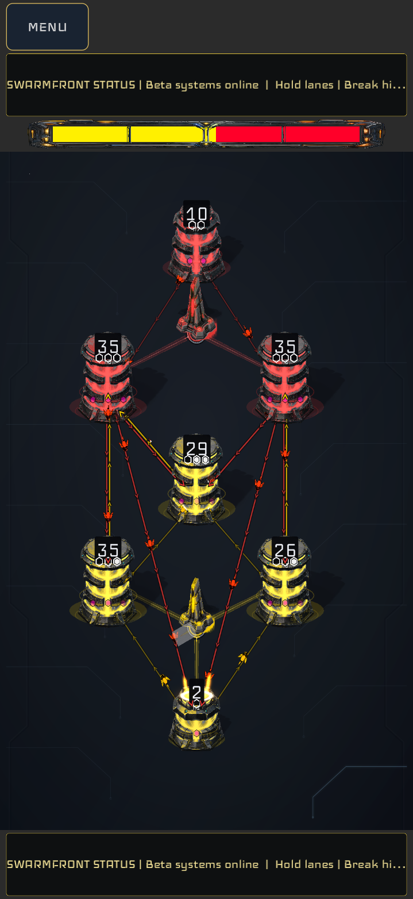
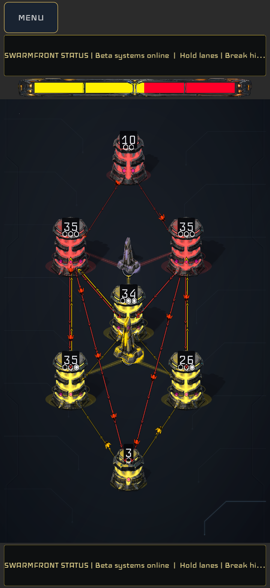

# Simple Syrup structure repair — September 29, 2026

The first repair pass preserves all seven Simple Syrup hives and their complete
legal-connection graph. It supplies two symmetric structure placements, each
with a tower and a barracks version. The public reference map remains available;
the four candidates are unpublished under `maps/_future/simple_syrup/`.

The archived map designer and continuous-wall work has been restored onto
current main in the isolated `codex/simple-syrup-map-pass-20260929` branch. The
[owner's map directions](map_design_direction_2026-09-29.md) govern subsequent
passes. This review completes the first Simple Syrup comparison, not the entire
map backlog.

## Candidates

| Candidate | Bottom / top positions | Bottom / top control hives | Opening choice |
|---|---|---|---|
| Start triangles | `(9,20)` / `(9,7)` | `1,2,3` / `7,5,6` | Capture both nearby neutrals to activate the structure while retaining the start. |
| Inner triangles | `(9,16)` / `(9,11)` | `2,3,4` / `5,6,4` | Control the nearby neutrals and contested center to activate the structure. |

Each candidate has one matching structure per half. These are exact top/bottom
reflections around `(8.5,13.5)`. Structures use supported integer cells: both
sit half a cell right of the hive axis, so this certifies the player-swapping
top/bottom symmetry rather than left/right symmetry. All hive coordinates,
start powers, neutral powers, IDs, and possible hive connections are retained.
There are no walls on this map to polish.

Editable sources are `map_sources/simple_syrup_start.draft.json` and
`map_sources/simple_syrup_center.draft.json`. The build tool produces `START_T`,
`START_B`, `CENTER_T`, and `CENTER_B` exports. Paired slots share an explicit
`symmetry_group`; mixed setup choices now select the same type for counterpart
slots. Ungrouped legacy maps keep their previous seeded selection behavior.

## Review and play

From this checkout, with the pinned Godot 4.7.1 engine at the usual sibling
`artifacts/toolchains` location:

```sh
python3 tools/run_simple_syrup_review.py --play --variant start --structure tower
python3 tools/run_simple_syrup_review.py --play --variant center --structure barracks
```

Use `--variant original` for the reference. Both candidate variants accept
`--structure tower` or `--structure barracks`. These commands launch the real
match scene against the production medium Balancer in a separate offline test
profile. They do not install a build on a phone. Override the engine location
with `--godot /absolute/path/to/Godot` if needed.

Reproduce the checks, screenshots and automated games:

```sh
python3 tools/run_simple_syrup_review.py --check
python3 tools/run_simple_syrup_review.py --capture
python3 tools/run_simple_syrup_review.py --bots
```

Each run uses isolated configuration/user data. The default output directory is
`artifacts/simple_syrup_review/` within the checkout. Open `review.html` after
`--capture` for an interactive before/after comparison with opening, 20-second
and 60-second frames. Each match also saves its initial/final state and accepted
local-player commands. Run the commands sequentially when sharing an output
directory.

This pass's retained local evidence is in
`SF/artifacts/simple-syrup-map-pass-2026-09-29/`: `review.html`, `captures/`,
`bots/bot_playtests.json`, focused test logs and `release/release.log`.
The captures are actual desktop rendering at 720 × 1565 with scripted local
commands against the production CPU. They are not human or phone-device tests.

## Intake corrections

The old authoring validator rejected Simple Syrup's half-cell hive coordinates,
even though the game preserves them. The designer now retains integer/half-cell
hives, previews their true connection endpoints, and checks runtime symmetry
using those same positions. Entity-authored structures now participate in the
layout contract, including powers and control groups. The compact-node importer
now preserves authored control IDs, ownership and power, then resolves numeric
and named hive references. Previously it discarded these fields and runtime
proximity selection silently substituted another triangle. Tests now inspect
both structure triangles after system binding and in the real match, not only
the structure-slot metadata.

Tower and barracks simulation centers now use authoritative precise hive world
positions instead of integer-rounded cells. This corrects the half-cell offset
in structure targeting/spawn origins without changing production, capture,
movement or damage rules.

The 18×28 template labels zero-based cell centers `(0,0)` through `(17,27)`;
the outside border starts at `(-0.5,-0.5)`. New exports reject out-of-bounds input
before it can disappear in the legacy loader. CQ2/3 still require their original
drawing convention to choose the correct conversion: their points at x=18 or
y=28 are rejected by the legacy loader. No speculative CQ coordinate rewrite
was made. Exact three-player 120° geometry remains unsupported by the current
lattice; Roundabout/Delta need a separate design and timing comparison.

## Verification

- All four exports pass geometric and actual runtime connection symmetry.
- 144 resolved setups cover both placements, both exports, tower/barracks/mixed
  selection, twelve seeds and swapped start assignments. Checks also reject
  mismatched groups, control triangles, structure powers and invalid coordinates.
- Final authoring gate passes: candidate freshness, 144 Simple Syrup setups,
  existing setup randomization/control assignment, symmetry, studio, finalizer
  and wall renderer checks. Existing lane availability, layout rules, PvP 1v1
  map contract and barracks route reset checks also pass.
- Generated exports are checked byte-for-byte against their retained drafts.
  Campaign rules and beta capture source fingerprints were regenerated through
  the canonical tools; campaign level definitions were not changed.
- All five rendered matches reach 60 seconds with accepted local commands. The
  four candidates retain their exact intended structure triangles at the start
  and end of the match capture.

The required fast release gate passed: onboarding/identity, authoring, all five
lane/input/presentation checks, MVP (26 checks), soak-launch contract, matrix
contract (15 pass, 13 tier skips), all eight selected boot configurations (five
tier skips), and all three selected soak routes. The complete authoring gate and
affected structure checks were rerun after the final intake/centroid fixes, and
both generated source fingerprints pass their final freshness checks. Logs are
retained as `authoring-final.log`, `*_final.log`, and `release/release.log`.
Performance soak and TestFlight preflight are outside this fast gate; this is a
review branch, not a mobile release or field-balance certification.

## Automated gameplay findings

All 16 games completed by conquest within the five-minute horizon: production
medium Balancer versus Raider, seeds 9292026 and 9292027, with their seats
swapped for each seed. The tournament advances the normal simulation in
canonical 100 ms steps. [Compact per-game evidence](simple_syrup_bot_pilot_2026-09-29.json)
retains outcomes, seeds, hashes and structure ownership.

| Candidate | Games | Match duration | First tower activation | Seat 1 / seat 2 wins |
|---|---:|---|---|---:|
| Start towers | 4 | 95.8–132.5 s | 15.1–15.2 s | 1 / 3 |
| Start barracks | 4 | 92.8–146.6 s | Not applicable | 1 / 3 |
| Inner towers | 4 | 97.9–260.6 s | 24.2–34.9 s | 2 / 2 |
| Inner barracks | 4 | 87.4–140.9 s | Not applicable | 1 / 3 |

The early tower capture difference supports the intended distinction: start
structures reward local expansion; inner structures require a center commitment.
Inner towers produced the longest matches in this small batch. Barracks capture
time is not recorded by the existing tournament diagnostic; no precise activation
time is claimed for those variants. Neither setup caused a timeout in these games.

## Visual finding and recommendation

Use the **start-triangle placement for the first human game**. The near-start
structures and lanes remain distinct in the captured opening and grown-hive
states. Retain the inner placement as an alternative with a stronger center
commitment, but its tall lower tower overlaps the center hive silhouette as it
grows. It needs a spacing/presentation pass before promotion; shrinking all hive
art is not the proposed remedy.

The existing renderer and simulation center structures on their controlling
hives. Merely nudging the authored slot would not cure that overlap. A follow-up
must explicitly consider the hive spacing or structure presentation while
preserving the control triangle and gameplay authority.

Actual 60-second frames (open either image for full size):

| Start towers: clearer separation | Inner towers: center overlap remains |
|---|---|
|  |  |

These results do not certify seat balance: four games per candidate are only a
pilot, and the winning seat/profile changes with the variant. Keep both placements
for human comparison rather than selecting one from these win counts. Geometric
equivalence does not by itself establish fun or measured seat balance. Test both
seats before a balance decision. The owner's next useful playtest is one game on each placement
with the same structure type, deciding whether local development or the early
center fight produces the better opening.
